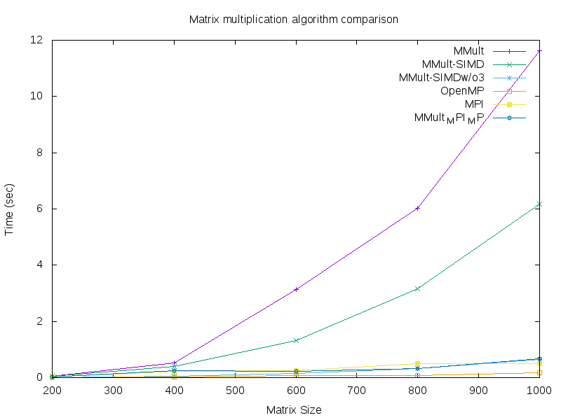

# Lab Parallel Computing
## Team matrix-02-anthony-mario-josh-steven
## SIMD,OMP, and MPI
- SIMD: Single instruction, multiple data. SIMD is a class of parrallel computers in which a single operation is performed on multiple data points simultaneously. These operations happen in parallel to eachother. However, only one process can be performed at once. Multiple data points cannot have different operations being performed on them concurrently. 
- OMP: OpenMP (Open Multi-Processing). OMP is an API that has support for shared memory multiprocessing programming in languages such as C. OpenMP and MPI can both be used to run applications that utilize parallel programming on a computer cluster. Including "#include <omp.h>" in a C file will allow multithreading within C functions.
- MPI: Message passing interface. MPI is a message-passing standard designed to work in conjunction with parallel computing. It acts as means of communication to make parallel computing efficient. It focuses on high performance and is readily available with free implementations. Including "#include <mpi.h>" is necessary for all MPI programs in C.

## Tasks

### Task1-2

This was simply following the instructions to be able to access the chinook server and wolf cluster. Issues happened when our output did not directly match the directions but was told that this did no matter as much. 

### Task3

This was applying the algorithm in class from the slides, we wanted to take advantage of locality when multiplying our array. So we set up the multiplication in a manner that would minimize our cache misses and thus increase the speed of the function. 

### Task4

This was simply taking the function from mmult_omp and incoporating it into my automate.c program. It was very similar to the SIMD w/o O3 function in terms of performance and code. Only differences was the parallelization part in the second half of the matrix multiplication algorithm. 

### Task5

For task five I took the template from mxv_omp_mpi and modified it in several ways. I had the program generate two matrices instead of a vector and a matrix and populated them both using gen_matrix. The controller would send a row from a and the full matrix from b to each worker. Inside the worker there was a nested for loop to do the row times matrix multiplication and I used part of the algorithm from SIMD to accomplish this. The answers were then stored in doubles array which then was sent back to the controller. The controller had a solution matrix which I called c and would use the MPI_TAG in order to populate the correct areas of the vectorized matrix. Some issues I had early on were null pointers to MPI_Bcast which resolved with allocating the memory before MPI_Init was called. I have to figure out to incorporate it into my automated test sequence, I tried some things passing in command line arguments but was having issues. I ended up running the four other algorithms together and runing MPI seperately.

### Graph

Graph is created using a jupyter notebook and matplotlib. I will look into setting up a virtual environment using poetry. One of the hurdles I have to overcome is runing mpi within my automate functions since it requires additional parameters. 

### Read in matrices

Reading in matrices for tasks 1-4 was fairly standard and straight forward solution however I was having issues with incorporating reading MPI into my automate function. 

## Distributed parallel computing
Explain the architecture of your solution.

Explain the variations of algorithm you implemented

SIMD optimizes the original algorithm by taking advantage of locality. The computer stores the array contigously in memory and our original algorithm had us hoping around in the array which would lead to cache misses and slowing down our program. 

## Teamwork
- List all team members in the README.md explain the contribution of each person.
### Anthony
- Conducted research on SIMD, OMP, and MPI and the differences between them
- Utilized mmult_omp_timing.c to test runtimes of mmult and mmult_omp and analyze the differences in their speeds for various sized n x n matricies
- Began implementation of task 5 based on given mxv_omp_mpi.c file
- Contributed to full project life cycle questions included in this README
### Mario 
- Formatted README.md
- Answered a portion of the questions on README.md
- Working on Matrix multiplication in C on Wolfgang cluster with both OpenMP and MPI
- Assisted in general
### Steven
- 
### Josh
- 

Did you lock the master branch as explain in GitHW2 Lab 2 - Git? How did you proceed to review each other work?

We did lock the master branch as explained in GitHW2 Lab 2 - Git. We each created seperate branches for our individual work and were able to review the changes in each other's branches before they were merged to master.

## Full project life cycle
- Have you used a project board? How did you used it, or if you did not use a project board how did you plan and manage your project and team work?

We chose to utilize the GitHub project board instead of Trello to keep all of our materials in one place for more efficient management of tasks. Each team member created their own tasks to be completed that were mainly broken up components of the main tasks that we were given. This allowed us to work individually while also ensuring that each task was completed in full.

- Is the usual cycle: write code, compile code,  run code, test code was the same when doing remote development on Wolfgand cluster. Did you need to adapt your way of working or use different tools?

We were able to implement the usual cycle using the Wolfgand cluster with the added step of pulling our repository to chinook after updates were made. Doing development remotely did not interfere with our process as we were able to review each other's changes using GitHub before moving on to testing on the cluster. Extra tools were not necessary.

- What kind of testing did you plan to use for this project? Did you consider measuring speed, memory consumption and validity of results for matrix multiplication. Did you consider that the code provided by the professor could have flaws?

Testing was mostly using the compare matrix methods in first check that our matrices were multiplying correctly. This was done using the read matrix from file method and a third file, I would use a small matrix which I had the answer to and compared if the values matched. 
I did consider that the code had flaws which led me to questioning the template provided by the mxv_omp_mpi file since it seemed as if certain things were not allocated correctly. 

- Did you need to write code or use tools to generate random matrix of specific sizes? Did you put this in your plan? 

It was mainly using tools and some code to generate random matrix of specific sizes as said in part of our plan and testing we would compare matrix methods first to check that our matrices were multiplying correctly whilist we worked individually to ensure that the requirements were met.

- Did you put in your plan the work needed to generate tables or graphs? Did you automate this work? 

Automating the production of graphs became a consideration after the first week's deliverables. The graphs for the tasks were assembled by Steven after completion of tasks. Originally, this was going to be done through another program but his plan for compiling the graphs was simple, straight forward and effective for the project.

- What proportion of the tasks (and time) in your plan is about writing variations on the matrix multiplication algorithm and what proportion is about testing and reporting activities?

The time allocated towards writing variations of the algorithm and testing and reporting was about equal. Many testing trials were required to ensure that each algorithm was working properly. As even small changes were made, testing was required to prove that we were on the right track. In other words, for every change we made to our various algorithms, testing and reporting was required alongside it.
