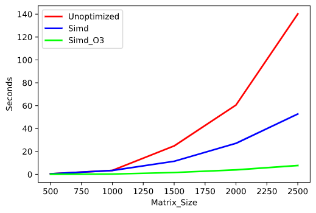

# Lab Parallel Computing
## Team matrix-02-anthony-mario-josh-steven
## SIMD,OMP, and MPI
- SIMD: Single instruction, multiple data. SIMD is a class of parrallel computers in which a single operation is performed on multiple data points simultaneously. These operations happen in parallel to eachother. However, only one process can be performed at once. Multiple data points cannot have different operations being performed on them concurrently. 
- OMP: OpenMP (Open Multi-Processing). OMP is an API that has support for shared memory multiprocessing programming in languages such as C. OpenMP and MPI can both be used to run applications that utilize parallel programming on a computer cluster. Including "#include <omp.h>" in a C file will allow multithreading within C functions.
- MPI: Message passing interface. MPI is a message-passing standard designed to work in conjunction with parallel computing. It acts as means of communication to make parallel computing efficient. It focuses on high performance and is readily available with free implementations. Including "#include <mpi.h>" is necessary for all MPI programs in C.

## Distributed parallel computing
Explain the architecture of your solution.

Explain the variations of algorithm you implemented

## Teamwork
List all team members in the README.md explain the contribution of each person. 

Did you lock the master branch as explain in GitHW2 Lab 2 - Git? How did you proceed to review each other work?

## Full project life cycle
Have you used a project board? How did you used it, or if you did not use a project board how did you plan and manage your project and team work?

Is the usual cycle: write code, compile code,  run code, test code was the same when doing remote development on Wolfgand cluster. Did you need to adapt your way of working or use different tools?

What kind of testing did you plan to use for this project? Did you consider measuring speed, memory consumption and validity of results for matrix multiplication. Did you consider that the code provided by the professor could have flaws?

Did you need to write code or use tools to generate random matrix of specific sizes? Did you put this in your plan? 

Did you put in your plan the work needed to generate tables or graphs? Did you automate this work?  

What proportion of the tasks (and time) in your plan is  about writing variations on the matrix multiplication algorithm and what proportion is about testing and reporting activities?

Include all tables, graphs and explanations needed to understand your work in the README.md file. No new or supplemental information should need to be communicated during the demo to grade your work.  
